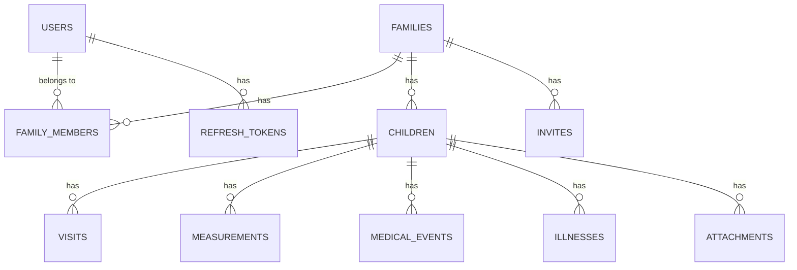

# Architecture

This document provides an overview of Trajectory's technical architecture, including the tech stack, data model, and system design.

## System Overview

Trajectory is a three-tier web application:

```
┌─────────────────┐
│   Frontend      │  React + Vite (Port 3000)
│   (React App)   │
└────────┬────────┘
         │ HTTP/HTTPS
         ▼
┌─────────────────┐
│    Backend      │  Express + Node.js (Port 3001)
│   (REST API)    │
└────────┬────────┘
         │ PostgreSQL Protocol
         ▼
┌─────────────────┐
│   Database      │  PostgreSQL 15 (Port 5432)
│  (PostgreSQL)   │
└─────────────────┘

External:
- Docker Volumes (File Storage)
- Reverse Proxy (HTTPS Termination)
```

## Technology Stack

### Frontend

- **React 18** - UI framework
- **TypeScript** - Type safety
- **Vite** - Build tool and dev server
- **React Router** - Client-side routing
- **Recharts** - Data visualization (growth charts)
- **CSS** - Custom styling with theme support

### Backend

- **Node.js** - Runtime environment
- **Express** - Web framework
- **TypeScript** - Type safety
- **pg** - PostgreSQL client
- **bcrypt** - Password hashing
- **jsonwebtoken** - JWT authentication
- **multer** - File upload handling
- **express-rate-limit** - Rate limiting

### Database

- **PostgreSQL 15** - Relational database
- **SQL migrations** - Schema versioning

### Infrastructure

- **Docker** - Containerization
- **Docker Compose** - Multi-container orchestration
- **Nginx** - Reverse proxy (external)

## Data Model

### Core Entities



### Tables

**users**
- Primary user accounts
- Stores: email, hashed password, name, role
- Authenticated via JWT

**families**
- Represents a household or family unit
- One family can have multiple users and people
- All data is scoped by family

**family_members**
- Junction table linking users to families
- Defines user-family relationships

**people**
- Stores person profile information
- Belongs to exactly one family
- Has: name, date of birth, sex, avatar

**visits**
- Medical appointments: wellness, sick, injury, vision
- Links to a person
- Stores: date, type, notes, attachments

**measurements**
- Growth tracking: height, weight, head circumference
- Links to a person
- Can be associated with a visit

**medical_events**
- Vaccines, procedures, medications
- Links to a person
- Stores: date, event type, description

**illnesses**
- Illness episodes with symptoms and treatments
- Links to a person
- Tracks: start/end dates, symptoms, medications, fever

**attachments**
- File uploads (images, PDFs, etc.)
- Can be linked to: people, visits, measurements
- Stored in Docker volumes

**refresh_tokens**
- JWT refresh tokens for session management
- Allows token revocation

**invites**
- Family invitation system
- Allows adding users to families via email

## Authentication Flow

```
1. User Registration
   ├─> POST /api/auth/register
   ├─> Hash password with bcrypt
   ├─> Create user record
   └─> Return access + refresh tokens

2. User Login
   ├─> POST /api/auth/login
   ├─> Verify password with bcrypt
   ├─> Generate JWT access token (15 min)
   ├─> Generate JWT refresh token (7 days)
   ├─> Store refresh token in database
   └─> Return both tokens

3. Authenticated Request
   ├─> Send: Authorization: Bearer <access_token>
   ├─> Verify JWT signature
   ├─> Extract user ID, family IDs, role
   └─> Process request

4. Token Refresh
   ├─> POST /api/auth/refresh
   ├─> Verify refresh token
   ├─> Check if valid in database
   ├─> Generate new access token
   ├─> Rotate refresh token
   └─> Return new tokens

5. Logout
   ├─> POST /api/auth/logout
   ├─> Revoke refresh token
   └─> Client discards tokens
```

## Authorization Model

### Family-Based Access Control

All sensitive data is scoped by family:

```typescript
// Example authorization check
if (!person.family_id || !user.family_ids.includes(person.family_id)) {
  return res.status(403).json({ error: 'Access denied' });
}
```

**Rules:**
- Users belong to one or more families
- Children belong to exactly one family
- Users can only access data for families they belong to
- Admins have elevated privileges (user/family management)

### Permission Levels

1. **Public** - Unauthenticated users
   - Can register and login
   
2. **Authenticated** - Logged-in users
   - Can access own profile
   - Can access family data they belong to
   
3. **Admin** - Users with admin role
   - Can manage all families and users
   - Can view system-wide statistics
   - First registered user is automatically admin

## API Architecture

### REST API Design

```
GET    /api/people              - List people
POST   /api/people              - Create person
GET    /api/people/:id          - Get person
PUT    /api/people/:id          - Update person
DELETE /api/people/:id          - Delete person

GET    /api/people/:id/measurements  - List measurements
POST   /api/people/:id/measurements  - Create measurement
...
```

### Request/Response Flow

```
1. Request
   └─> Rate Limiter (middleware)
       └─> Authentication (middleware)
           └─> Query Parser (middleware)
               └─> Route Handler
                   └─> Authorization Check
                       └─> Database Query
                           └─> Response

2. Error
   └─> Error Handler (middleware)
       └─> Error Logger (middleware)
           └─> JSON Error Response
```

### Middleware Stack

1. **Rate Limiter** - Prevents brute force
2. **Authentication** - Verifies JWT
3. **Query Parser** - Parses filter/sort/pagination
4. **Validation** - Validates request body
5. **Error Handler** - Catches and formats errors
6. **Error Logger** - Logs errors (dev mode)

## File Storage

### Upload Architecture

```
Client
  └─> POST /api/people/:id/avatar (multipart/form-data)
      └─> Multer Middleware
          ├─> Validate file type
          ├─> Validate file size
          ├─> Generate unique filename
          └─> Save to volume
              └─> Store path in database
                  └─> Return URL
```

### Storage Locations

- **Avatars**: `trajectory_avatars` volume → `/app/avatars`
- **Attachments**: `trajectory_uploads` volume → `/app/uploads`

### File Serving

Files are served via static middleware:

```typescript
app.use('/avatars', express.static('/app/avatars'));
app.use('/uploads', express.static('/app/uploads'));
```

URLs: `https://your-domain.com/avatars/filename.jpg`

## Database Schema Management

### Migration System

Migrations stored in `backend/migrations/`:

```
migrations/
├── schema.sql                           # Base schema
├── 20260203-000000-email-optional.sql   # Migration 1
└── 20260204-000000-temperature-decimal.sql  # Migration 2
```

### Migration Runner

On startup, the backend:

1. Connects to PostgreSQL
2. Creates `migrations` table if not exists
3. Reads all migration files
4. Runs unapplied migrations in order
5. Records applied migrations

### Schema Versioning

The `migrations` table tracks applied migrations:

```sql
CREATE TABLE migrations (
  id SERIAL PRIMARY KEY,
  name VARCHAR(255) UNIQUE NOT NULL,
  applied_at TIMESTAMP DEFAULT CURRENT_TIMESTAMP
);
```

## Error Handling

### Error Types

```typescript
class AppError extends Error {
  statusCode: number;
  isOperational: boolean;
}
```

**Operational Errors** (expected):
- 400 Bad Request - Invalid input
- 401 Unauthorized - Missing/invalid auth
- 403 Forbidden - Insufficient permissions
- 404 Not Found - Resource doesn't exist

**Programming Errors** (unexpected):
- 500 Internal Server Error - Bugs, crashes

### Error Response Format

```json
{
  "error": "Human-readable error message",
  "code": "ERROR_CODE",
  "details": { }
}
```

## Performance Considerations

### Database Indexes

Key indexes for performance:

```sql
-- Frequently queried fields
CREATE INDEX idx_people_family_id ON people(family_id);
CREATE INDEX idx_visits_person_id ON visits(person_id);
CREATE INDEX idx_measurements_person_id ON measurements(person_id);
CREATE INDEX idx_illnesses_person_id ON illnesses(person_id);

-- For date range queries
CREATE INDEX idx_visits_date ON visits(date);
CREATE INDEX idx_measurements_date ON measurements(measured_at);
```

### Query Optimization

- Use prepared statements (prevents SQL injection + performance)
- Limit result sets with pagination
- Filter at database level, not application level
- Use database transactions for multi-step operations

### Caching Strategy

Currently **no caching layer** (planned):
- Consider Redis for session storage
- Consider caching frequently-accessed data
- API responses are not cached (data changes frequently)

## Scalability

### Current Limitations

- **Single database instance** - No replication
- **Local file storage** - Not distributed
- **In-process rate limiting** - Doesn't scale horizontally

### Scaling Options (Future)

**Horizontal Scaling:**
- Load balancer → Multiple backend instances
- Shared database (PostgreSQL with read replicas)
- Shared file storage (S3, MinIO, NFS)
- Redis for distributed session/cache

**Vertical Scaling:**
- Increase database resources (CPU, RAM, storage)
- Increase backend container resources

## Security Architecture

### Defense in Depth

**Layer 1: Network**
- Firewall rules
- HTTPS only (via reverse proxy)

**Layer 2: Application**
- Rate limiting
- Input validation
- Output encoding

**Layer 3: Authentication**
- bcrypt password hashing
- JWT tokens
- Token expiration

**Layer 4: Authorization**
- Family-based access control
- Role-based permissions

**Layer 5: Data**
- Parameterized queries
- No sensitive data in logs

See [Security Guide](./security.md) for details.

## Monitoring and Logging

### Logging

**Development:**
- Request/response logging
- Detailed error stack traces

**Production:**
- Error logging only
- No request body logging
- Sanitized error messages

### Metrics

Currently **no metrics collection** (planned):
- Request count/latency
- Database query performance
- Error rates
- User activity

Consider integrating:
- Prometheus + Grafana
- Application Performance Monitoring (APM)

## Deployment Architecture

### Docker Compose Production

```yaml
services:
  database:
    image: postgres:15
    volumes:
      - trajectory_db:/var/lib/postgresql/data
    
  backend:
    build: ./backend
    depends_on:
      - database
    volumes:
      - trajectory_uploads:/app/uploads
      - trajectory_avatars:/app/avatars
    
  frontend:
    build: ./frontend
    ports:
      - "3000:80"
    depends_on:
      - backend
```

### Recommended Production Setup

```
Internet
  ↓
Firewall (443, 80)
  ↓
Reverse Proxy (Nginx/Caddy)
  ├─> HTTPS Termination
  ├─> Rate Limiting
  └─> Security Headers
      ↓
  Docker Host
    ├─> Frontend Container (port 3000)
    ├─> Backend Container (port 3001)
    └─> Database Container (port 5432, internal only)
```

## Future Architecture Considerations

**Planned Enhancements:**
- Two-factor authentication (2FA)
- Email notifications
- Data export/import
- Multi-family user access improvements
- Real-time updates (WebSockets)
- Mobile app (React Native)
- Backup/restore tooling
- Audit logging
- Advanced search and filtering

**Technical Debt:**
- Add comprehensive test coverage
- Implement API rate limiting on all endpoints
- Add database connection pooling
- Optimize database queries
- Add frontend error boundary handling
- Improve TypeScript type coverage
